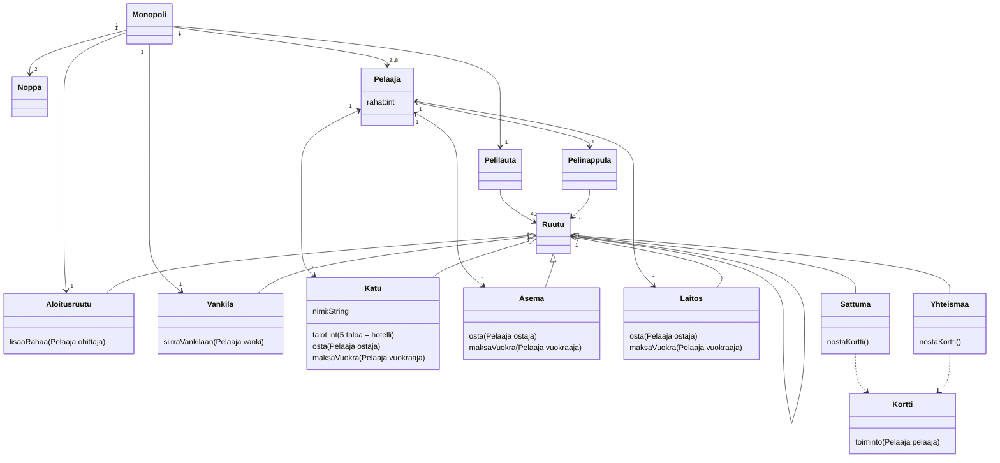

## Tehtävä 2

```mermaid
classDiagram
    Monopoli "1" --> "2" Noppa
    Monopoli "1" --> "2..8" Pelaaja
    Monopoli "1" --> "1" Pelilauta
    Monopoli "1" --> "1" Aloitusruutu
    Monopoli "1" --> "1" Vankila

    class Katu {
        nimi:String
        talot:int (5 taloa = hotelli)

        osta(Pelaaja ostaja)
        maksaVuokra(Pelaaja vuokraaja)
    }

    class Asema {
        osta(Pelaaja ostaja)
        maksaVuokra(Pelaaja vuokraaja)
    }

    class Laitos {
        osta(Pelaaja ostaja)
        maksaVuokra(Pelaaja vuokraaja)
    }

    class Pelaaja {
        rahat:int
    }

    Pelilauta --> "40" Ruutu
    Pelaaja --> "1" Pelinappula
    Pelinappula --> "1" Ruutu
    Ruutu --> "1" Ruutu
    Pelaaja "1" <--> "*" Katu
    Pelaaja "1" <--> "*" Asema
    Pelaaja "1" <--> "*" Laitos

    class Aloitusruutu {
        lisaaRahaa(Pelaaja ohittaja)
    }

    class Vankila {
        siirraVankilaan(Pelaaja vanki)
    }

    Ruutu <|-- Aloitusruutu
    Ruutu <|-- Vankila
    Ruutu <|-- Sattuma
    Ruutu <|-- Yhteismaa
    Ruutu <|-- Asema
    Ruutu <|-- Laitos
    Ruutu <|-- Katu

    class Sattuma {
        nostaKortti()
    }

    class Yhteismaa {
        nostaKortti()
    }

    Sattuma ..> Kortti
    Yhteismaa ..> Kortti

    class Kortti {
        toiminto(Pelaaja pelaaja)
    }
```