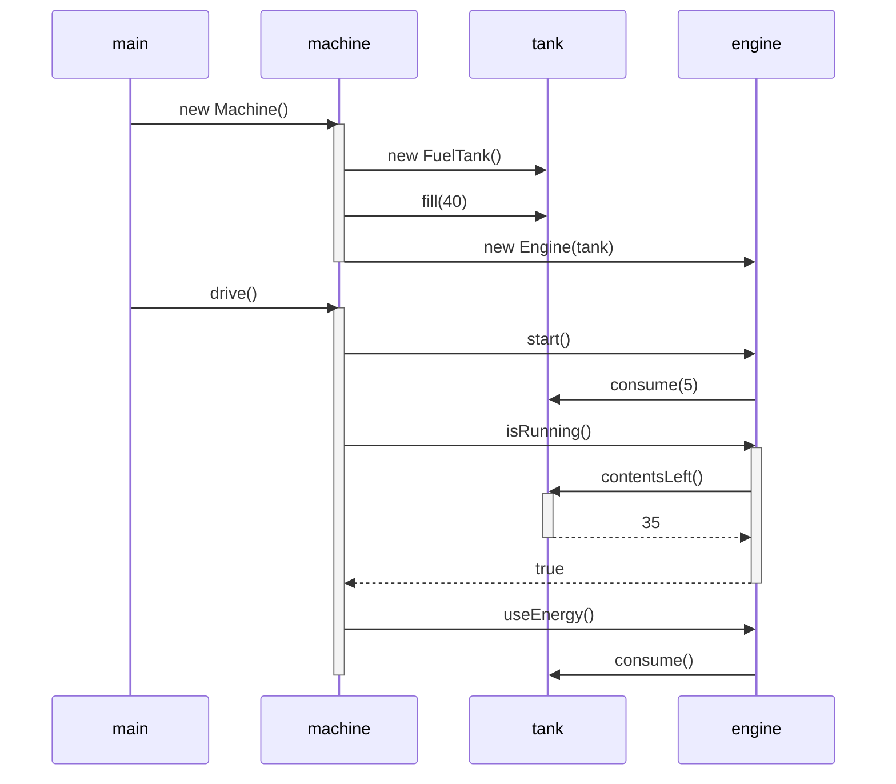

## Tehtävä 3

```mermaid
sequenceDiagram
    main->>machine: new Machine()
    activate machine
    machine->>tank: new FuelTank()
    machine->>tank: fill(40)
    machine->>engine: new Engine(tank)
    deactivate machine
    main->>machine: drive()
    activate machine
    machine->>engine: start()
    engine->>tank: consume(5)
    machine->>engine: isRunning()
    activate engine
    engine->>tank: contentsLeft()
    activate tank
    tank-->>engine: 35
    deactivate tank
    engine-->>machine: true
    deactivate engine
    machine->>engine: useEnergy()
    engine->>tank: consume()
    deactivate machine
```