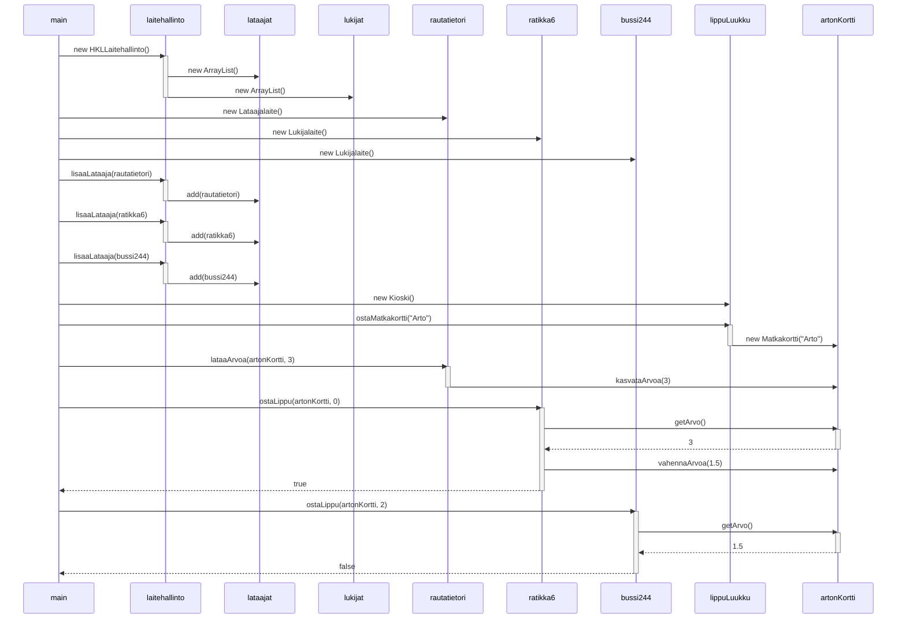

## Tehtävä 4

```mermaid
sequenceDiagram
    main->>laitehallinto: new HKLLaitehallinto()
    activate laitehallinto
    laitehallinto->>lataajat: new ArrayList()
    laitehallinto->>lukijat: new ArrayList()
    deactivate laitehallinto
    main->>rautatietori: new Lataajalaite()
    main->>ratikka6: new Lukijalaite()
    main->>bussi244: new Lukijalaite()
    main->>laitehallinto: lisaaLataaja(rautatietori)
    activate laitehallinto
    laitehallinto->>lataajat: add(rautatietori)
    deactivate laitehallinto
    main->>laitehallinto: lisaaLataaja(ratikka6)
    activate laitehallinto
    laitehallinto->>lataajat: add(ratikka6)
    deactivate laitehallinto
    main->>laitehallinto: lisaaLataaja(bussi244)
    activate laitehallinto
    laitehallinto->>lataajat: add(bussi244)
    deactivate laitehallinto
    main->>lippuLuukku: new Kioski()
    main->>lippuLuukku: ostaMatkakortti("Arto")
    activate lippuLuukku
    lippuLuukku->>artonKortti: new Matkakortti("Arto")
    deactivate lippuLuukku
    main->>rautatietori: lataaArvoa(artonKortti, 3)
    activate rautatietori
    rautatietori->>artonKortti: kasvataArvoa(3)
    deactivate rautatietori
    main->>ratikka6: ostaLippu(artonKortti, 0)
    activate ratikka6
    ratikka6->>artonKortti: getArvo()
    activate artonKortti
    artonKortti-->>ratikka6: 3
    deactivate artonKortti
    ratikka6->>artonKortti: vahennaArvoa(1.5)
    ratikka6-->>main: true
    deactivate ratikka6
    main->>bussi244: ostaLippu(artonKortti, 2)
    activate bussi244
    bussi244->>artonKortti: getArvo()
    activate artonKortti
    artonKortti-->>bussi244: 1.5
    deactivate artonKortti
    bussi244-->>main: false
    deactivate bussi244
```